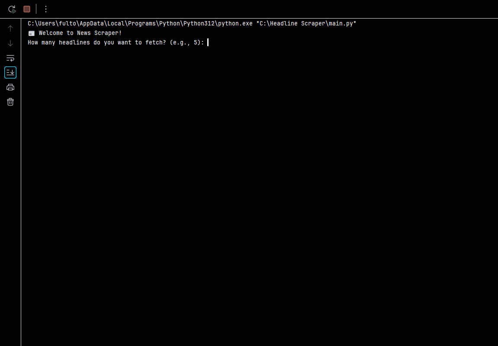

# 📰 News Scraper

A Python command-line tool that fetches the latest news headlines from NPR using BeautifulSoup and requests. You can filter results by keyword, control how many headlines are shown, and export them to CSV or TXT.

---

## 🚀 Features

✅ Scrapes top headlines from [NPR News](https://www.npr.org/sections/news/)  
✅ Filter by keyword (optional)  
✅ Set how many headlines to view  
✅ Export to **CSV** or **TXT**  
✅ Clean terminal output  
✅ Beginner-friendly code and structure

---

## 📸 Preview



---

## 💻 How to Run

### 1. Clone the repo
```bash
git clone https://github.com/rinnemunch/news-scraper.git
cd news-scraper 

2. Set up virtual environment 
python -m venv venv
source venv/bin/activate  # Windows: venv\Scripts\activate

3. Install dependencies 
pip install -r requirements.txt

4. Run the program 
python main.py

Example Usage 
How many headlines do you want to fetch? (e.g., 5): 5
Filter headlines by keyword? (press Enter to skip): climate
Export format? (csv/txt/none): csv
✅ Saved to headlines.csv

📁 Project Structure
main.py         
# CLI logic
README.md
scraper.py      
# Web scraping logic (NPR headlines)

📦 Dependencies
- requests 
- beautifulsoup4

Install with: 
pip install requests beautifulsoup4

🔓 License
MIT — Free to use, modify, and share